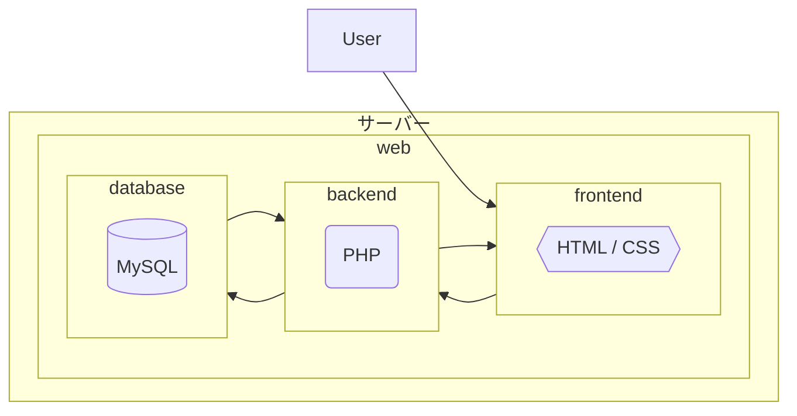

# 図書館蔵書システム

## システム概要

システムの概要については、[outline-design.md](./outline-design.md)を参照

## 環境構築

### Docker

以下のコマンドでコンテナをビルド・実行

```
docker compose up -d --build
```

### XAMPP等

`/www/html/~g234201/`内のファイルを`htdocs`にコピー

### データベース設定

MySQLにrootでログインして[create-table.sql](./create-table.sql)内のコードをコピーして貼り付けて実行

Dockerの場合はMySQLのコンテナに入ってからログインする

## システム構成

