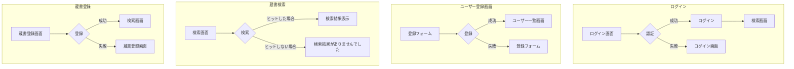
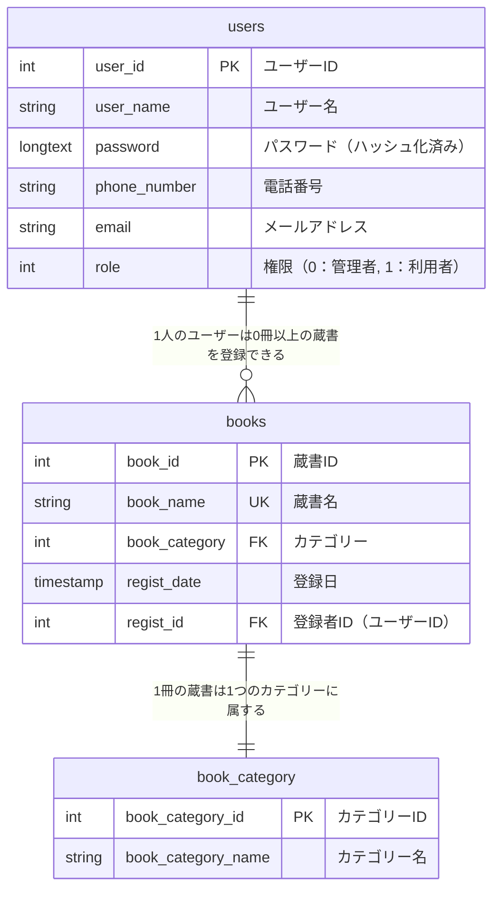

# 図書館蔵書システム・概要設計

## 機能構成

### ①蔵書登録機能

**概要**

- 蔵書の情報を登録できる
- データ
  - 蔵書ID（PK）
  - 蔵書名（UK）
  - カテゴリー（FK）
  - 登録日
  - 登録者ID（登録者のID）（FK）
- **使用できるのは図書館管理者のみ**
  - `role：0`のユーザーが使用可能

### ②蔵書検索機能

**概要**

- 蔵書を検索する
  - 「蔵書ID」、「蔵書名」、「カテゴリー」、「登録者名」の4項目を入力してORで部分一致するものを出力

### ③ユーザー登録機能

**概要**

- ユーザーを登録する
- 登録は管理者が行うものとする
- データ
  - ユーザーID（PK）
  - ユーザー名
  - パスワード（ハッシュ化して保存）
  - 電話番号
  - メールアドレス
  - 権限・role
    - 0：管理者
    - 1：利用者

### ④ログイン機能

**概要**

- ユーザーIDとパスワードが一致するものでログインする

## 画面構成

### 画面遷移図

## データベース構成

### ER図

